# ClearSky Cloud Cost Explorer

A modern, full-stack cloud cost management dashboard for visualizing and analyzing AWS cloud spend across business domains.

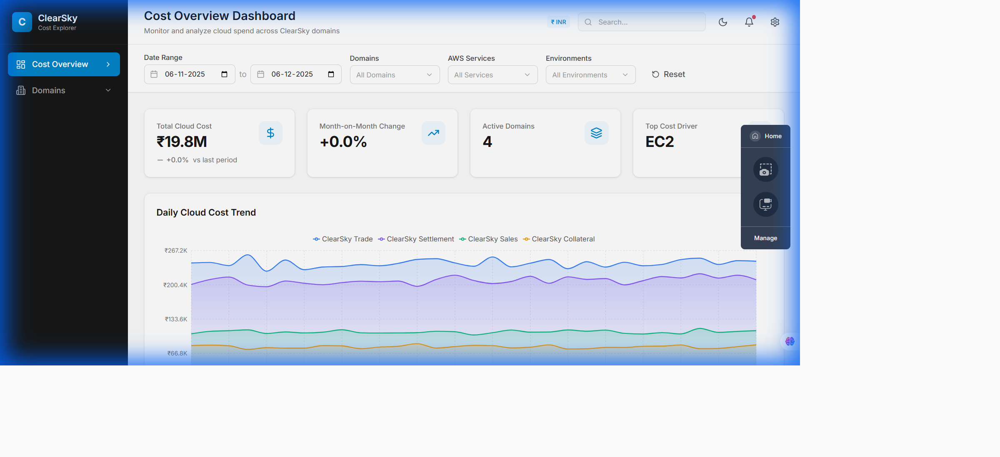

## ✨ Features

### 📊 Comprehensive Dashboard
- **KPI Cards**: Real-time metrics showing total cloud cost, monthly average, highest cost domain, and total services
- **Time Series Chart**: Visualize cost trends over time with interactive line charts
- **Stacked Bar Chart**: Analyze daily costs broken down by domain
- **Donut Chart**: See cost distribution across all domains at a glance

### 🌓 Dark/Light Theme Toggle
Seamlessly switch between light and dark modes with a single click. Your preference is saved to localStorage.

| Light Mode | Dark Mode |
|------------|-----------|
|  | 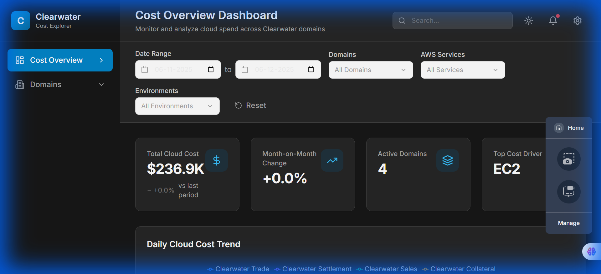 |

### 🏢 Domain Management
- **Domains Overview**: View all business domains with their costs, change percentages, and service counts
- **Domain Details**: Drill down into individual domains to see service-level cost breakdowns
- **Sidebar Navigation**: Quick access to all domains via expandable sidebar menu

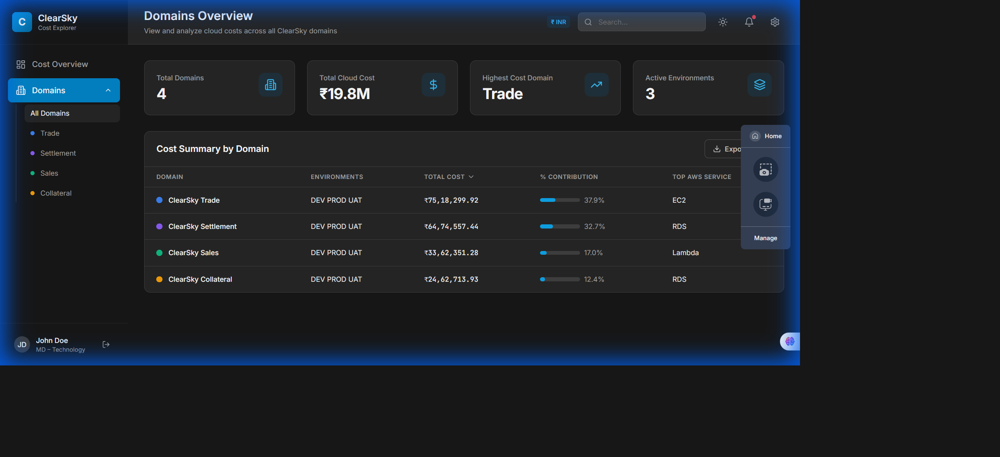

### 💱 Multi-Currency Support
Switch between USD ($), EUR (€), GBP (£), and INR (₹) currencies. All values are automatically converted using real-time exchange rates.

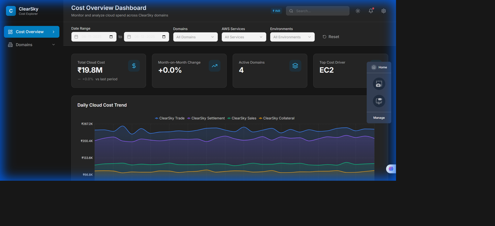

### 🔔 Notifications & Settings
- **Notifications Dropdown**: View cost alerts and important notifications
- **Settings Panel**: Configure theme, currency, and email alerts

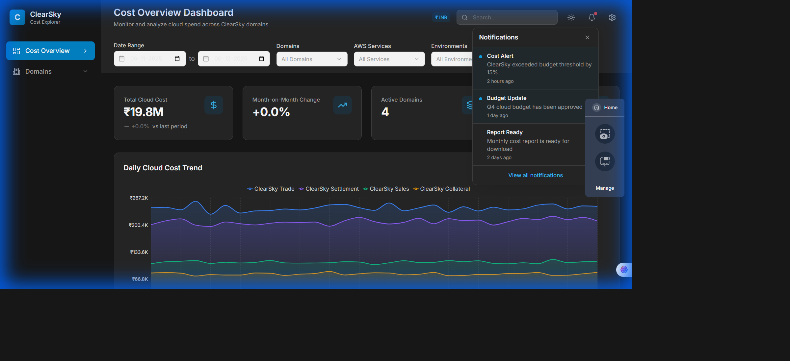

### 🧭 Intuitive Navigation
- **Collapsible Sidebar**: Navigate between Dashboard, Domains, and Settings
- **Expandable Domain Menu**: Quick access to individual domain detail pages

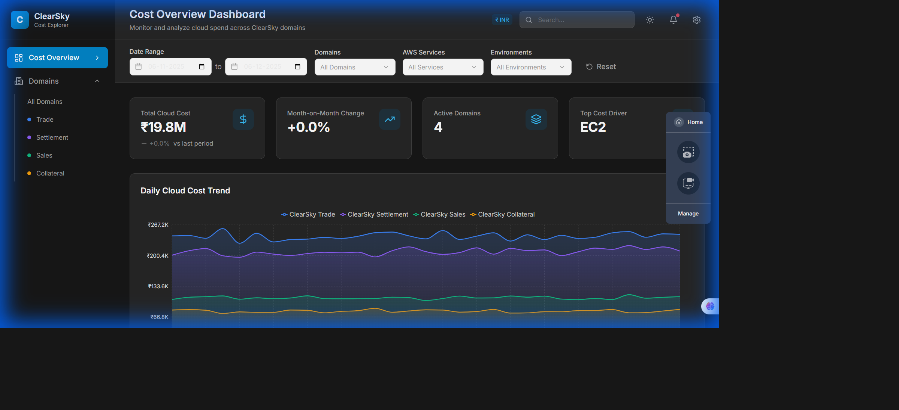

### 📄 Domain Detail View
Detailed analysis of individual domains including:
- Domain info card (owner, cost center)
- Service-level cost breakdown table
- Time series cost chart
- Environment-specific filtering

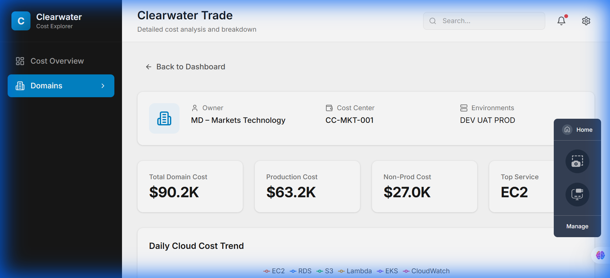

## 🔐 Authentication
Secure login page with modern design (currently stub implementation for demo purposes).

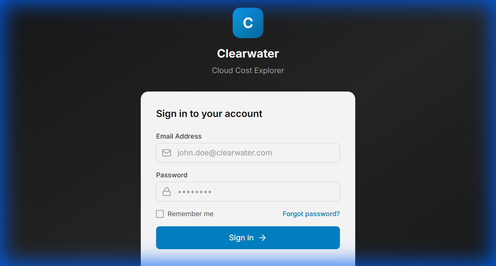

---

## 🛠️ Technology Stack

### Frontend
- **React 18** with TypeScript
- **Vite** for fast development and building
- **Tailwind CSS** for styling
- **Recharts** for data visualization
- **React Router** for navigation
- **Lucide React** for icons

### Backend
- **Node.js** with Express
- **TypeScript** for type safety
- **CSV-based data storage** for easy data management

---

## 📐 Wireframes

<details>
<summary>Click to view UI wireframes</summary>

### Login Page
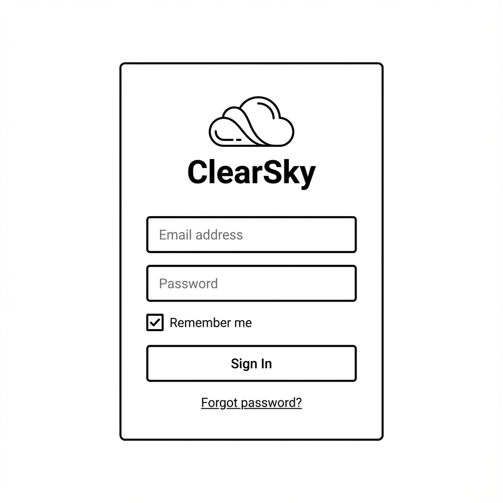

### Dashboard
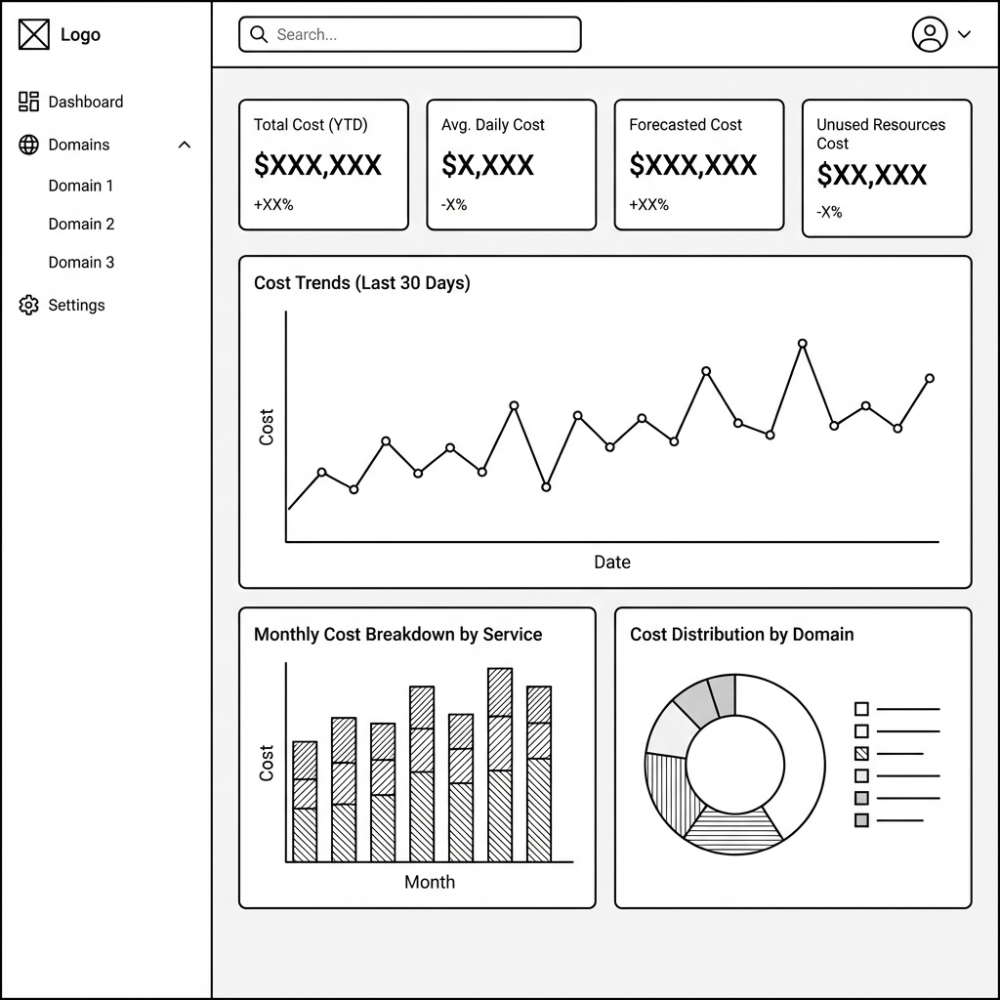

### Domains Overview
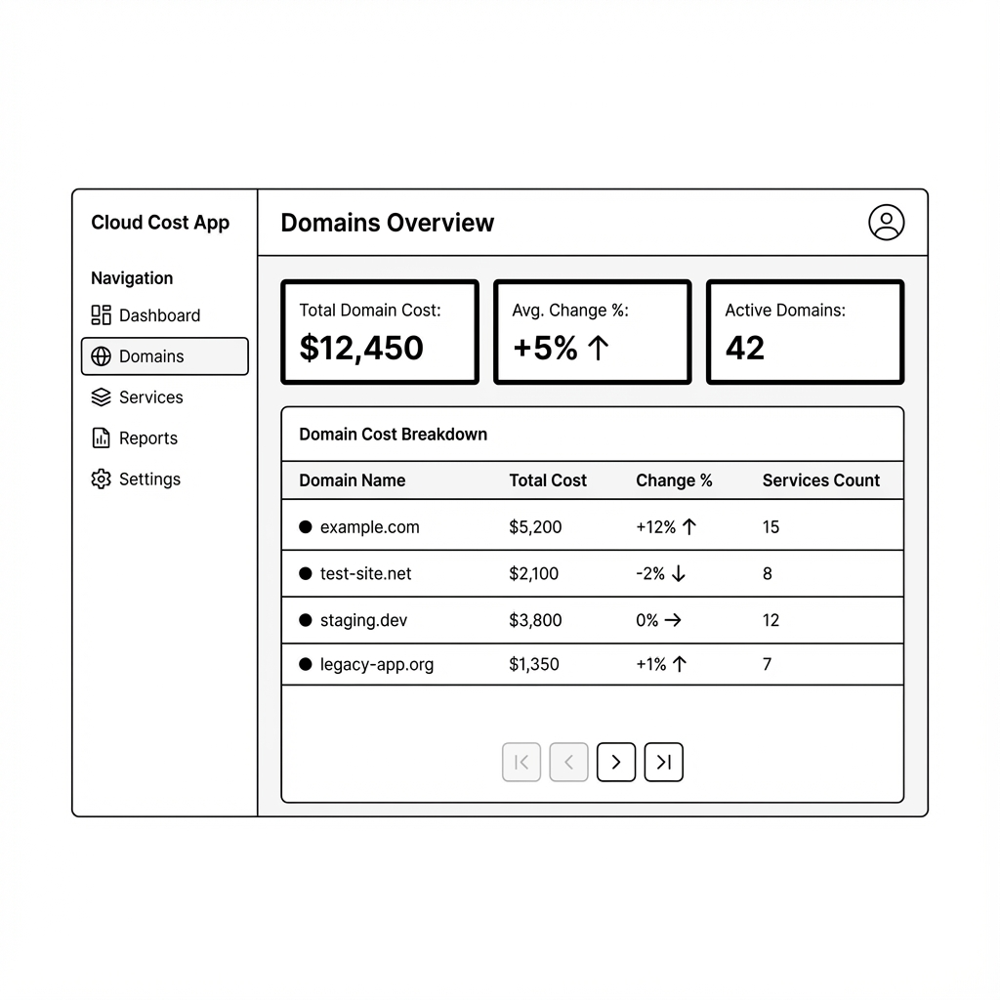

### Domain Detail
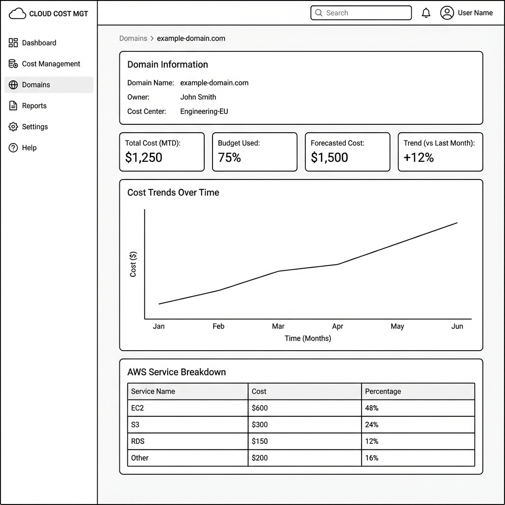

</details>

---

## 🚀 Getting Started

### Prerequisites
- Node.js 18+ 
- npm or yarn

### Installation

1. **Clone the repository**
   ```bash
   git clone https://github.com/YOUR_USERNAME/clearsky-cost-explorer.git
   cd clearsky-cost-explorer
   ```

2. **Install backend dependencies**
   ```bash
   cd backend
   npm install
   ```

3. **Install frontend dependencies**
   ```bash
   cd ../frontend
   npm install
   ```

### Running the Application

1. **Start the backend server** (runs on port 3001)
   ```bash
   cd backend
   npm run dev
   ```

2. **Start the frontend** (runs on port 5173)
   ```bash
   cd frontend
   npm run dev
   ```

3. **Open your browser** to `http://localhost:5173`

---

## 📁 Project Structure

```
clearsky-cost-explorer/
├── backend/
│   ├── data/                   # CSV data files
│   │   ├── domains.csv         # Domain definitions
│   │   ├── services.csv        # AWS service definitions
│   │   └── cost_records.csv    # Cost data records
│   ├── src/
│   │   ├── data/mockData.ts    # Data loading utilities
│   │   └── index.ts            # Express server
│   └── package.json
├── frontend/
│   ├── src/
│   │   ├── components/         # React components
│   │   │   ├── charts/         # Chart components
│   │   │   ├── filters/        # Filter components
│   │   │   ├── layout/         # Header, Sidebar
│   │   │   └── tables/         # Table components
│   │   ├── hooks/              # Custom React hooks
│   │   ├── pages/              # Page components
│   │   ├── types/              # TypeScript types
│   │   └── App.tsx
│   └── package.json
├── docs/
│   ├── screenshots/            # Demo screenshots
│   └── wireframes/             # UI wireframes
└── README.md
```

---

## 📝 API Endpoints

| Endpoint | Method | Description |
|----------|--------|-------------|
| `/api/domains` | GET | Get all domains |
| `/api/services` | GET | Get all AWS services |
| `/api/costs/summary` | GET | Get cost summaries by domain |
| `/api/costs/timeseries` | GET | Get time series cost data |
| `/api/stats` | GET | Get overall statistics |

---

## 🎨 Design System

The application uses a consistent design system with:
- **Primary colors**: Indigo/violet gradients
- **Domain colors**: Unique colors for each business domain
- **Dark mode**: Full dark theme support
- **Responsive design**: Works on desktop and tablet screens

---

## 📄 License

This project is licensed under the MIT License.

---

## 🤝 Contributing

Contributions are welcome! Please feel free to submit a Pull Request.

---

Built with ❤️ using React, TypeScript, and Node.js
